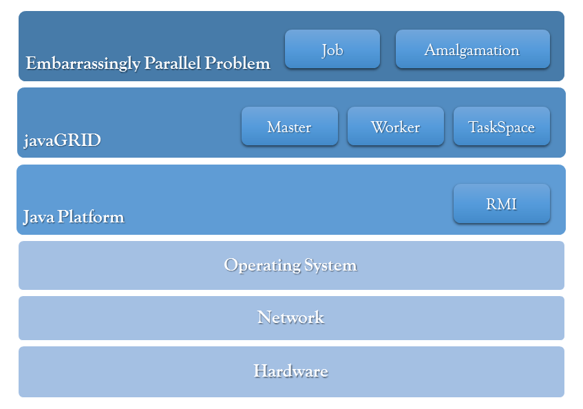
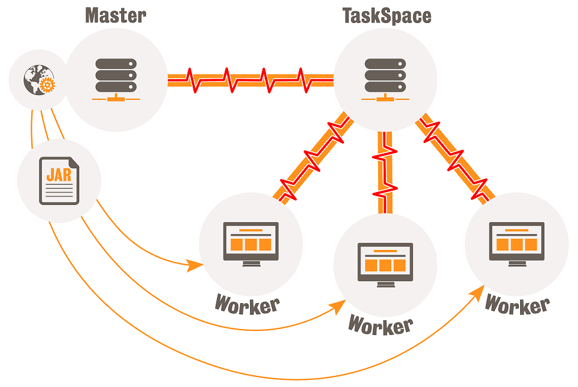
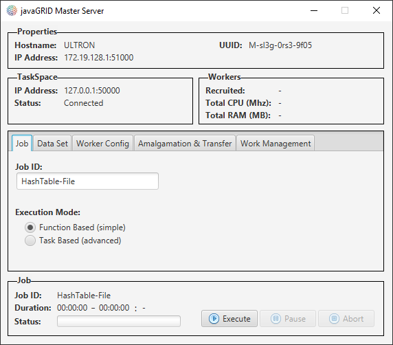
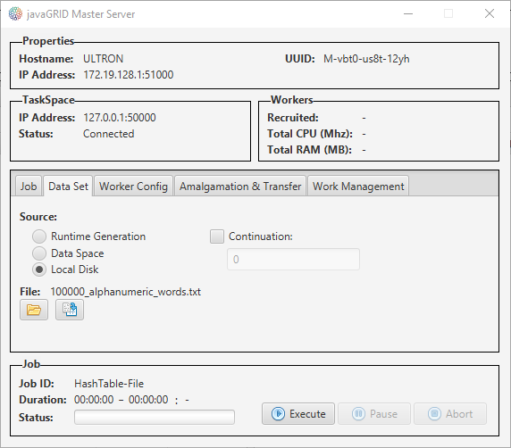
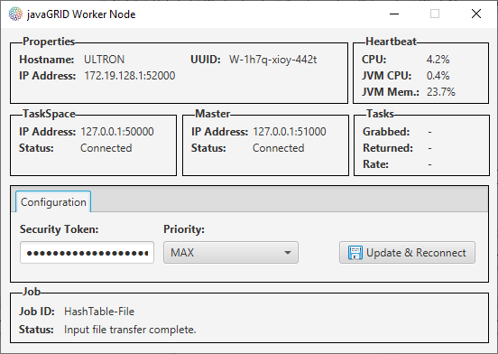
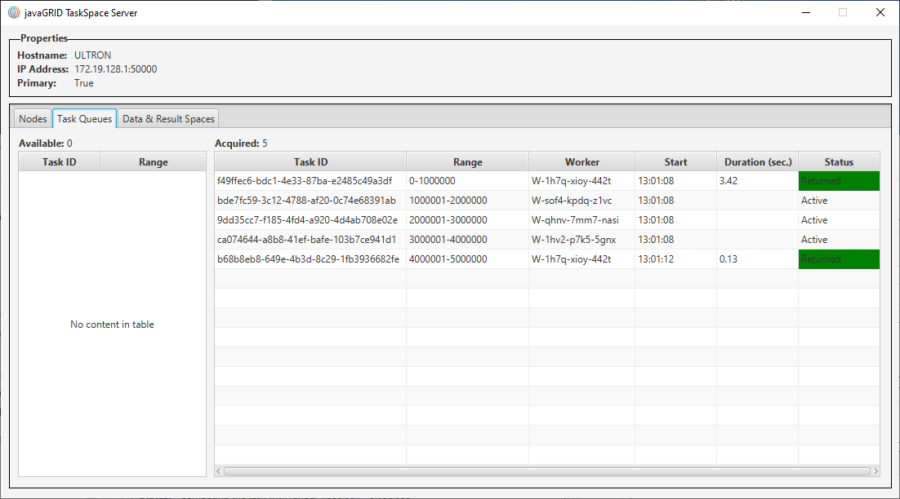
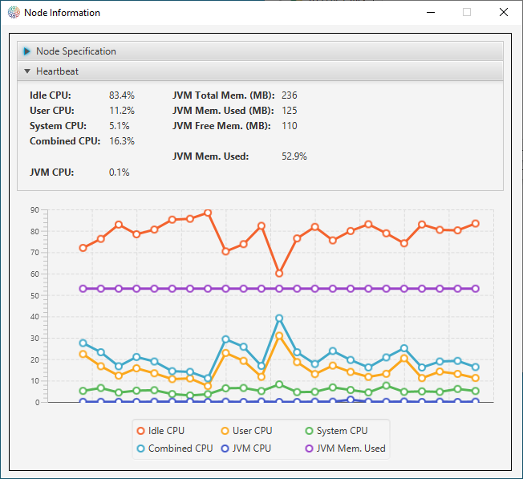
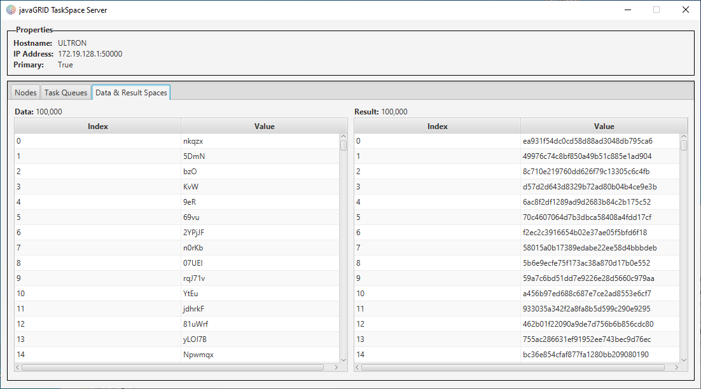

# JavaGRID

JavaGRID is a grid-based re-usable framework which is capable of distributing a user-defined embarrassingly parallel (EP) problem on heterogeneous clients. The framework is both fault-tolerant and performance centric, adopting a master-worker paradigm utilising a task queue for efficient scheduling. The framework alleviates technical burdens, such as inter-process communication, security, fault-tolerance, etc. on the user by passing responsibility for grid interaction wholly to the framework, and as such, the user can focus on the EP problem alone.

I completed this work as part of a postgraduate Master's degree at King's College London, accompanied by a paper titled ***"javaGRID - A Grid-Based, Distributed Processing Framework for Embarrassingly Parallel Problems"***.

> JavaGRID utilises the Java Platform providing a framework for computing EP problems

> At a high-level, JavaGRID applies a master-worker paradigm and a task-queue for scheduling 

**Features**
- Allows the definition of any EP problem
- Is abstract to facilitate continual reuse
- Can dynamically load the problem class into the computing nodes without recompilation
- Provides a mechanism for importing and distributing input data
- Maximises performance of the grid, and thus reduce computation time, by reducing worker idleness
- Allows the result set to be amalgamated as required by the user
- Provide all the necessary components to distribute the job e.g. master and worker nodes
- Accommodates the heterogeneity of host systems they operate on
- Remove as many ‘operational’ burdens as possible e.g. inter-process communication, security, fault-tolerance, etc.
- Simple to use but has the flexibility for more complex usecases
- Scales both via additional nodes, and utilisation of additional cores for maximum computing capability
- Monitor pro-actively for failed workers and reassign tasks not returned
- Implement a time-out mechanism, for which we can assume a task will not be returned i.e. reactively reclaim failed tasks
- Maximise utilisation of each host by allowing for multiple instances of the worker thread to be run
- Ensure unauthorised nodes cannot submit, compute or return data on the grid
- Minimise the risk of malicious code being executed at a worker node
- Allow for jobs to begin at an offset of the input set
- Provide an intuitive UI for job submission and continual monitoring
- Facilitate easy configuration of each node type e.g. IP addresses and the Internet
- Encourage future enhancement and extensibility
- Constantly monitor each node for real-time metrics e.g. CPU utilisation
- Location independent discovery
- Utilises minimum number of external Java libraries (3 in total)

## Why

I was curious to revist the project, and after fixing deprecated code, I thought I'd upload a working version for anyone else interested in this domain.

## Components

> The Master Server defines the job specification and hosts the EP problem

> The Master also hosts or uploads input data required, if required, for the job

> Worker nodes authenticate with both the Master and TaskSpace using a security token

> The TaskSpace Server manages the queue of available tasks, both adding new tasks and keeping track of already assigned ones

> The Worker nodes report resourcing metrics for monitoring

> The TaskSpace can also act as a central repositry for both the input data, for jobs that require it, and where the results from the Worker nodes can be stored before amalgmation

## Running JavaGRID

Assuming you've implemented the functions (*initialise, runtimeGeneration, computation*) in *javagrid.master.job* and (*amalgamateInitialise, amalgamateDataSpace, amalgamateFile*) in *javagrid.master.amalgamate*, then the following sequence is required.

1. Compile everything under */src*
2. Start *javagrid.taskspace.TaskSpaceMainApp* and *javagrid.master.MasterMainApp* in that order
3. Configure the Master client to set the job specification, ensuring it matches your selected job functions coded earlier. If using the provided EP examples, this step isn't required as it's loaded from the supplied job spec file
4. Start *n* clients using *javagrid.worker.WorkerMainApp* as desired
5. Commence grid computation using the *Execute* button on the Master client

## Notes
- Ensure a directory named "jobs" is present in the TaskSpace run directory i.e. *javagrid/taskspace* prior to starting
- The DataSpace store is an in-memory function, and the upper bounds is dependant on host RAM and JVM memory configuration
- Computational speed and job runtime is highly dependant on task granularity; adjust this setting (on the Master client) to discover the optimal value for your specefic EP problem

## Acknowledgements
- [RMIIO library for large file streaming](https://openhms.sourceforge.io/rmiio/)
- [Hyperic SIGAR for accessing operating system and hardware level information in Java](https://sourceforge.net/projects/sigar/)
- [SQLite used for the javaGRID file format](https://sqlite.org/)